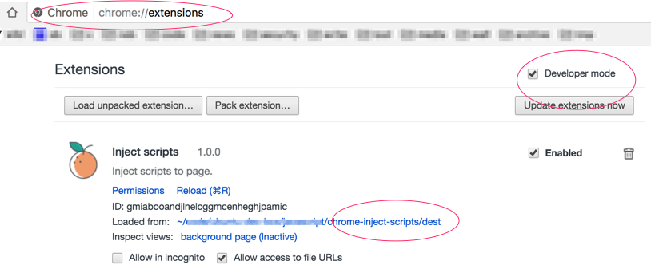

chrome extension: inject scripts to current tab

## build & install

    git clone <this-repo>
    yarn install
    yarn build
    ls dest
    # drag `dest` folder in chrome on `chrome://extensions/` page

## capture

